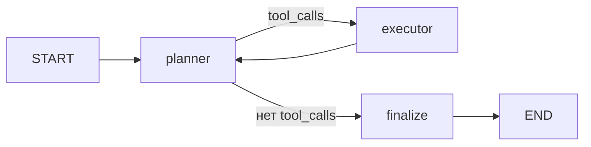

# Туристический ассистент (LangGraph)

Агент составляет **культурную программу поездки** по городу и датам: билеты туда-обратно (самолёт, поезд, автобус), музеи и мероприятия, рестораны в пешей доступности от достопримечательностей, городской транспорт и лайфхаки. Данные берутся из **живого веб-поиска** (не из заглушек).

## Быстрый старт

### Требования

- Python **3.10+** (работает на 3.9+)
- Ключ **OpenAI API** (через [ProxyAPI](https://proxyapi.ru) или напрямую)

### Установка и запуск

```bash
git clone <url-репозитория>
cd tourist-assistant

python3 -m venv .venv
source .venv/bin/activate   # Windows: .venv\Scripts\activate

pip install -r requirements.txt

cp .env.example .env
# Отредактируйте .env: OPENAI_API_KEY=...

python main.py
```

Программа запросит в терминале:

1. **Город поездки** (например, `Санкт-Петербург`)
2. **Даты** (например, `1-4 августа 2026`)
3. **Город отправления** (Enter = `Москва`)
4. **Запрос** (например, `Составь культурную программу, рестораны от 4.7`)

Через 1–2 минуты в консоли появится программа с разделами: **Билеты**, **Мероприятия**, **Питание**, **Транспорт**, **Лайфхаки**.

### Переменные окружения

| Переменная | Обязательно | Описание |
|------------|-------------|----------|
| `OPENAI_API_KEY` | Да | Ключ для LLM |
| `PROXY_BASE_URL` | Нет | По умолчанию `https://openai.api.proxyapi.ru/v1` |
| `TAVILY_API_KEY` | Нет | Точнее веб-поиск; без ключа — DuckDuckGo (`ddgs`) |

Шаблон: [`.env.example`](.env.example).

---

## Архитектура



| Узел | Роль |
|------|------|
| `planner` | LLM планирует и вызывает инструменты |
| `executor` | Выполняет веб-поиск, возвращает `ToolMessage` |
| `finalize` | Собирает структурированную программу (`FinalProgram`) |

**Инструменты (3):**

| Инструмент | Что ищет |
|------------|----------|
| `search_roundtrip_tickets` | Авиа, РЖД/Tutu, автобус |
| `search_culture_events` | Афиша, музеи, выставки (по району) |
| `search_dining_and_transport` | Рестораны (много ссылок) + транспорт |

Стек: **LangGraph 0.2+**, **LangChain 0.3**, **ChatOpenAI** (`gpt-4o-mini`), **Pydantic**, **ddgs** / **Tavily**.

---

## Проектирование агента

### Какую задачу решает агент?

По городу, датам и городу отправления агент **собирает актуальную информацию из интернета** и формирует **готовую культурную программу** с билетами (3 вида транспорта), мероприятиями, питанием рядом с музеями, транспортом внутри города и практическими советами.

### Кто будет пользоваться агентом?

**Частные путешественники** и **менеджеры поездок** (самостоятельный туризм): люди, которые планируют культурную поездку без турагентства и хотят один запрос вместо ручного поиска на Aviasales, Афише и картах.

### С какими внешними системами и данными работает агент?

| Система | Назначение |
|---------|------------|
| **OpenAI API** (ProxyAPI) | Планирование, tool calling, финальный ответ |
| **Tavily API** (опционально) | Веб-поиск с ответом-сводкой |
| **DuckDuckGo** (`ddgs`, ru-ru) | Бесплатный веб-поиск по умолчанию |
| **Aviasales / Яндекс.Путешествия** | Ссылки и сниппеты по авиабилетам |
| **РЖД / Tutu.ru** | Поезда |
| **Bus.ru и аналоги** | Автобусы |
| **Афиша / Kassir.ru** | Мероприятия |
| **2GIS / Яндекс.Карты / TripAdvisor** | Рестораны и транспорт |

Прямые партнёрские API этих сервисов **не подключены** — агент находит публичные страницы через поиск.

### Почему нужен именно агент, а не workflow?

- **Нестабильный ввод**: даты и города в свободной форме, уточнения в запросе пользователя.
- **Многошаговый сбор**: нужно решить, какие инструменты вызвать, в каком порядке, когда данных достаточно для финала.
- **Синтез из шума**: сниппеты поиска разнородны — LLM отбирает факты, группирует по районам, не смешивает «билеты на самолёт» и «билеты в музей».
- **Адаптация**: при пустом или слабом поиске агент честно указывает ссылки «уточните на сайте», а не ломает пайплайн.

Детерминированный пайплайн «3 фиксированных HTTP-запроса → шаблон» не покрывает вариативность запросов и качество сниппетов.

### Сложные и нестандартные ситуации

| Ситуация | Обработка |
|----------|-----------|
| **Пустой или нерелевантный поиск** | Фильтр по категории + fallback; в ответе — предупреждение и ссылки сервисов |
| **Ошибка поиска / сети** | `ToolMessage` с текстом ошибки; граф не падает, planner продолжает |
| **Prompt-injection во вводе** | `sanitize_and_validate` блокирует подозрительные фразы |
| **Галлюцинации цен** | Промпт: цены только из `digest`; иначе «уточните на сайте» |
| **Даты в далёком будущем** | В поиске может не быть точных цен — агент даёт ориентиры и ссылки |
| **Конфликт категорий** (музей в «Билетах») | Постфильтрация + раздельные промпты для `tickets` / `events` / `restaurants` |

### Как понять, что агент работает хорошо?

| Критерий | Приемлемый результат |
|----------|----------------------|
| **Полнота программы** | Все 5 разделов заполнены; в «Билетах» есть блоки ✈️ 🚂 🚌 со ссылками |
| **Опора на поиск** | В «Питании» ≥ 6 ресторанов со ссылками из `restaurants_digest`; мероприятия сгруппированы по району |
| **Надёжность прогона** | `python main.py` завершается без падения графа; при отсутствии `OPENAI_API_KEY` — понятная ошибка до запуска |

---

## Структура репозитория

```
tourist-assistant/
├── main.py              # Агент, инструменты, граф LangGraph, CLI
├── requirements.txt     # Зависимости (pip install -r)
├── .env.example         # Шаблон секретов
├── README.md
└── .cursor/rules/       # Правила Cursor (в т.ч. синхронизация README)
```

---

## Разработка

- Перед коммитом синхронизируйте **README** с кодом — см. правило [`.cursor/rules/readme-sync.mdc`](.cursor/rules/readme-sync.mdc).
- Коммиты: [Conventional Commits](.cursor/rules/conventional-commits.mdc), subject ≤ 20 символов.

## Лицензия

Уточните у владельца репозитория.
